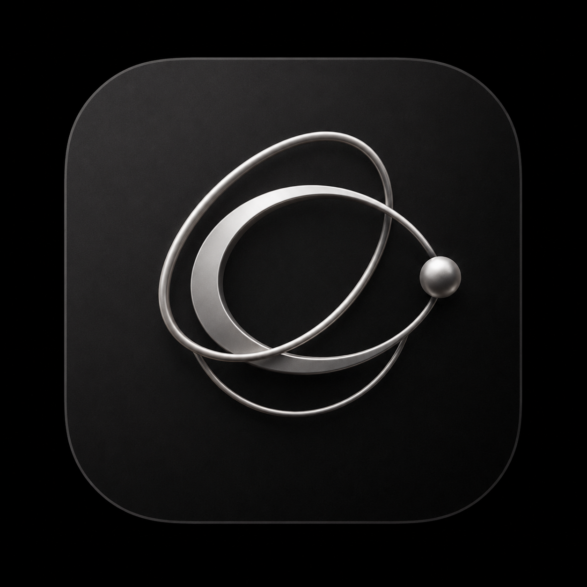

<div align="center">
  

  <h1>Conation</h1>

  <p>Русскоязычное рабочее пространство: документы, сообщения, задачи, почта и AI-инструменты в одном приложении.</p>
</div>

> Статус на 2 сентября 2026 года. Репозиторий находится в активной миграции
> с upstream Macro на самостоятельный white-label продукт Conation. Ниже
> намеренно отделено то, что уже можно собрать и запустить, от того, что ещё
> требует production-доводки.

## Что можно запустить сейчас

| Сценарий                  | Текущий статус                                                                                                                                                                             |
| ------------------------- | ------------------------------------------------------------------------------------------------------------------------------------------------------------------------------------------ |
| Веб-приложение в браузере | SolidJS/Vite-клиент собирается в статический SPA. Локальный стек открывает его по адресу `http://localhost:3000/app`.                                                                      |
| Локальная разработка      | Репозиторий поднимает Postgres/pgvector, Redis, OpenSearch, Kafka, FusionAuth, LocalStack, Mailpit, API и workers. Это контур разработки и проверки, а не защищённый публичный production. |
| Standalone web build      | Профиль `standalone` использует same-origin API и не должен незаметно обращаться к управляемым сервисам Macro. Оператор всё равно должен развернуть backend и настроить ingress.           |
| Desktop                   | Общий web-клиент упаковывается оболочкой Tauri. Исходная сборка доступна, но подписанный и notarized macOS-релиз пока не подтверждён.                                                      |
| Hosted legacy             | Отдельный явный профиль совместимости для прежней управляемой инфраструктуры. Он не является рекомендуемым режимом Conation.                                                               |

Да: Conation работает не только как desktop-приложение. Основной интерфейс —
веб-клиент; Tauri использует тот же клиент в нативной оболочке.

Публичный домен `conation.dev` сейчас отвечает служебным JSON, а не готовым
web-приложением. `docs.conation.dev` и `mcp-server.conation.dev` разрешаются в
DNS, но их TLS/приложение не были подтверждены этой проверкой. Поэтому ссылки
на них пока считаются планируемыми, а не опубликованными пользовательскими
точками входа.

## Быстрый старт

Репозиторий приватный, поэтому для клонирования нужен доступ GitHub к
`agisota/conation`:

```bash
git clone https://github.com/agisota/conation.git
\cd conation
nix develop
```

На macOS дополнительно нужен работающий Docker runtime: Docker Desktop,
OrbStack или Colima. Подробности и диагностика портов — в
[инструкции локального запуска](docs/RUNNING_LOCALLY.md).

Запуск полного локального контура без командных Doppler-секретов:

```bash
just doctor-local
just run_local --no-doppler
```

После готовности откройте `http://localhost:3000/app`. Одноразовый код входа
попадает в локальный Mailpit: `http://localhost:8025`.

В Cursor Cloud используются репозиторные entrypoint-скрипты:

```bash
bash .cursor/infra.sh
bash .cursor/stack.sh
```

После изменения Rust-backend:

```bash
bash .cursor/rebuild.sh
```

## Сборка web и standalone

Проверка production-компиляции выполняется из `apps/web`:

```bash
\cd apps/web
bunx vite build -c vite.config.ts
```

Полный репозиторный рецепт дополнительно готовит WASM и проверяемый артефакт:

```bash
\cd apps/web
just build-prod
just check-standalone-artifact
```

По умолчанию production-сборка использует `standalone` и вычисляет API от
origin, с которого отдан SPA. Если оператору нужен фиксированный origin:

```bash
VITE_CONATION_OPERATOR_ORIGIN=https://conation.example just build-prod
```

`conation.example` здесь — пример, а не существующий сервис. Профиль прежнего
managed-развёртывания включается только явно:

```bash
just build-hosted-legacy
```

## Сборка desktop на macOS

Установите Xcode Command Line Tools, войдите в Nix shell и выполните:

```bash
\cd apps/web
CONATION_OPERATOR_ORIGIN=https://conation.example just tauri-build-standalone
```

Команда собирает приложение под адрес конкретного оператора. Она не выпускает
за вас Apple Developer certificate, provisioning profile, notarization ticket
или файлы universal links. До прохождения этих gates результат подходит для
локальной проверки, но не должен называться готовым публичным релизом.

## Функциональные границы

В исходном дереве реализованы поверхности документов, каналов и личных
сообщений, задач, поиска, контактов/CRM, календаря, email, AI/agent и MCP.
Наличие поверхности в UI не означает, что любая внешняя интеграция заработает
без настройки:

- Gmail и Google OAuth требуют собственных credentials оператора.
- Mailpit перехватывает локальные транзакционные письма. Он не предоставляет
  пользователям почтовые ящики.
- Экспериментальный Stalwart ещё не подключён как полноценный backend почты:
  нет подтверждённого end-to-end provisioning, JMAP sync и outbound delivery.
- GitHub-функции требуют GitHub OAuth/App credentials и разрешений.
- AI требует ключа выбранного провайдера. Автоматическая цепочка fallback между
  несколькими моделями пока не подтверждена end-to-end и здесь не обещается.
- Платёжная логика и внешние SaaS-интеграции могут оставаться в коде как
  исторические контракты; AGPL-лицензия не делает внешние API бесплатными.
- Асинхронные письма, push, digest и часть уведомлений ещё не локализованы для
  каждого получателя.

Полная карта зависимостей и честная граница self-host находятся в
[статусе self-hosting](infra/selfhost/README.md). Это поддерживаемая локальная
база для разработки и smoke-тестов, но пока не готовый Internet-facing
production-дистрибутив.

## Русский язык

Conation запускается на русском языке для нового профиля. Пользователь может
переключиться на английский в настройках аккаунта; выбор сохраняется в браузере
и обновляет `<html lang>`. Английский остаётся исходным каталогом и fallback
для отсутствующего перевода. Архитектура, ICU-склонения и непокрытая backend-
граница описаны в [документе локализации](docs/LOCALIZATION.md).

Новые строки должны получать смысловые ключи. Идентификаторы, URL, SQL-схема,
API values, fixtures и фрагменты кода переводить нельзя.

## Бренд и ассеты

В README используется локальный точный master, предоставленный владельцем
проекта, а не GitHub user-attachment. Происхождение, размеры, SHA-256 и
производные web/Tauri-иконки перечислены в
[реестре бренда](apps/web/public/brand/README.md).

Планируемые адреса бренда:

- поддержка — `pythia@conation.dev`;
- технический директор — `tars@conation.dev`;
- генеральный директор — `ramzan.kadyrov@conation.dev`.

DNS/MX, доставка и возможность ответа для этих адресов должны быть проверены
отдельно. До такой проверки это целевые identities, а не обещание работающей
почты.

## Структура репозитория

```text
conation/
├── apps/web/       SolidJS/Vite и оболочки Tauri
├── services/       Rust/TypeScript API, consumers и workers
├── crates/         доменные библиотеки и DB-клиенты
├── packages/       общие TypeScript-пакеты
├── docker/         локальная Compose-инфраструктура
├── infra/          локальная оркестрация и AWS-oriented Pulumi
├── docs/           архитектурные и операторские документы
└── tooling/        just-рецепты, генераторы и тестовые harness
```

Некоторые внутренние имена (`macrodb`, `macro_user`, Cargo/TypeScript symbols,
переменные окружения, persisted volumes) сохраняются как технические или
миграционно-чувствительные контракты. Они не являются пользовательским брендом.
Классификация и критерии удаления собраны в
[карте ребрендинга](docs/REBRAND_CONATION.md).

## Лицензия и происхождение

Код распространяется по GNU Affero General Public License v3.0; полный текст —
в [LICENSE.txt](LICENSE.txt). При сетевом предоставлении модифицированной версии
учитывайте обязанность AGPL предоставить соответствующий исходный код
пользователям этой версии.

Conation — производная работа/форк исходного проекта
[`macro-inc/macro`](https://github.com/macro-inc/macro). Git-история и
атрибуция upstream должны сохраняться. Файлы
[CONTRIBUTING.md](CONTRIBUTING.md) и связанные CLA-процессы пока относятся к
upstream-правилам; они не переименовываются и не считаются новой политикой
Conation без отдельного решения правообладателя.
